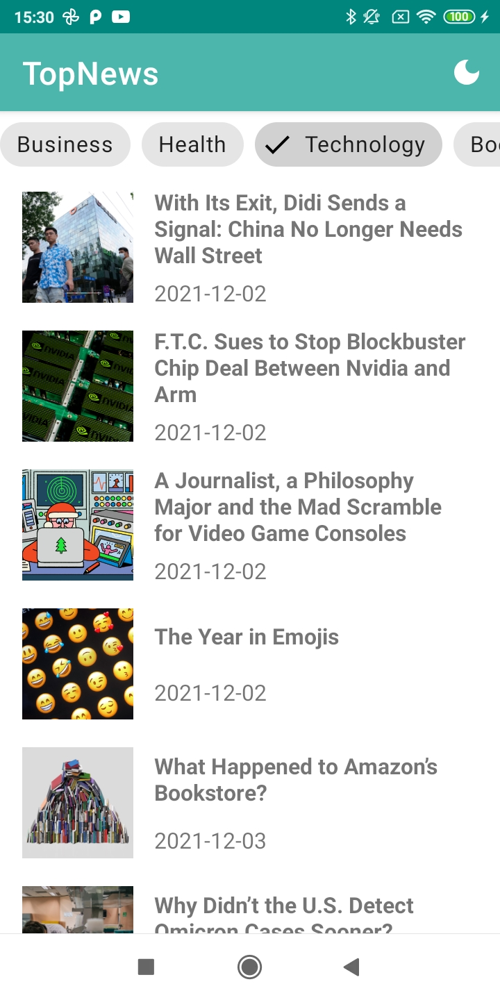
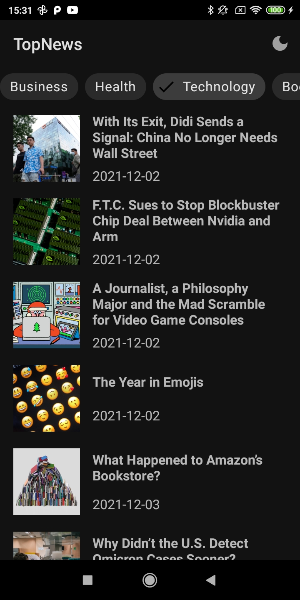

<h1>TopNews</h1>

“Read only important world news”

## Technologies

- [Kotlin](https://kotlinlang.org/)
- [MVVM](https://developer.android.com/topic/libraries/architecture/viewmodel)
- [Coroutines](https://github.com/Kotlin/kotlinx.coroutines)
- [Retrofit](https://square.github.io/retrofit/)
- [Dagger Hilt](https://developer.android.com/training/dependency-injection/hilt-android)
- [Flow](https://developer.android.com/kotlin/flow)
- [Navigation](https://developer.android.com/guide/navigation)
- [Glide](https://github.com/bumptech/glide)

## Screenshots

